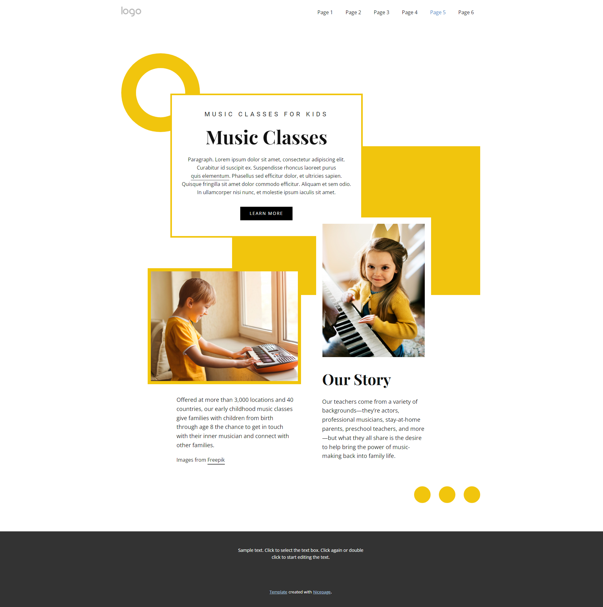

# Music Classes Landing Page (HTML/CSS Project)

A clean, modern, and visually engaging landing page designed for promoting a children's music education program. The design showcases proficiency in asymmetrical layout techniques and graphic elements integration, featuring:
- **Clean Navigation:** A header with a logo and simple page links.
- **Hero Section:** Prominent section for "Music Classes" with a title, descriptive text, and a strong call-to-action button.
- **Asymmetrical Design:** Utilization of large, colored geometric shapes (yellow circles and squares) to create a dynamic, engaging layout.
- **Image Integration:** Seamlessly integrated images showcasing children interacting with musical instruments.
- **Content Blocks:** Detailed sections for program facts and the school's "Our Story."

Features a **fully responsive layout** built using pure HTML5 and CSS3, demonstrating strong command over **CSS Grid/Flexbox** for complex, creative compositions.

## 🔗 Live Demo
https://your-username.github.io/css-06-music-classes-landing-page/

## 📸 Preview

## 🛠️ Tech Used
- **HTML5:** Semantic structure and organization.
- **CSS3:** Advanced layout techniques (Grid and/or Flexbox for complex positioning), custom typography, and styling of abstract shapes.

## 📂 Folder Structure
│── index.html  
│── style.css  
│── images/  
│── assets/  
|   └── screenshot.png  

## 🚀 How to Use
1. Clone:  `git clone https://github.com/tayyab-balti/css-06-music-classes-landing-page.git`

2. Double-click `index.html` to run in your browser.